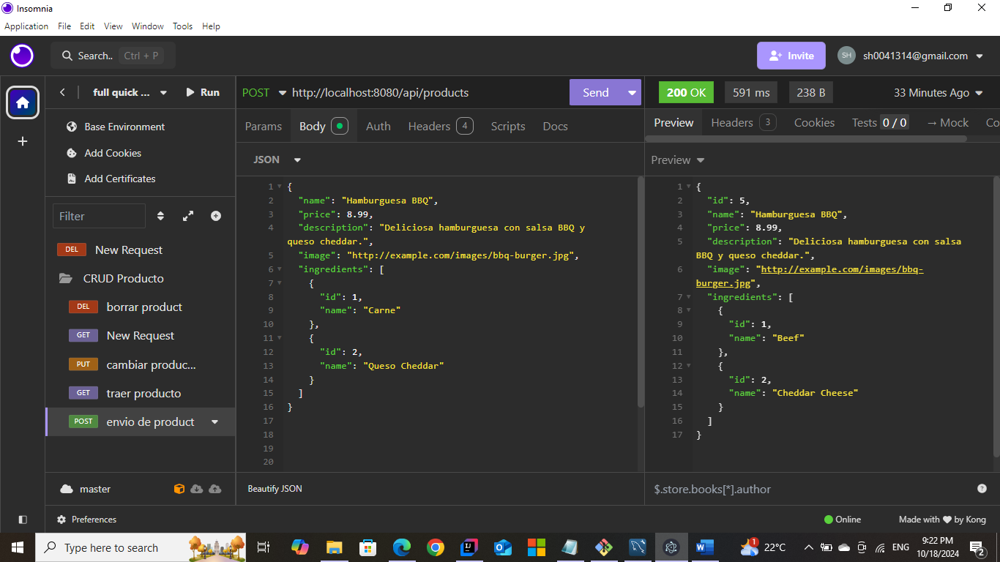

# Quick-Bites-Management-System

Sitio para el manejo completo de Quick Bites back y front end con mysql, Java e Intellij

## Funcionalidades

1. CRUD para productos.
2. CRUD para pedidos.
3. Control de pedidos. Sistema de gestión de inventarios.
4. Funcionalidad para registrar ventas y facturación.
5. Integración con WhatsApp para recibir pedidos.
6. Requisitos Java 17+ MySQL

## Dependencias de Spring Boot.

- Spring Web: Para crear aplicaciones web y RESTful.
- Spring Data JPA: Para trabajar con bases de datos a través de JPA (Java Persistence API).
- MySQL Driver: Para conectarte a tu base de datos MySQL.
- Spring Boot DevTools: Para facilitar el desarrollo (recarga automática).
- Spring Security: Si planeas implementar autenticación y autorización en el futuro.
- Lombok: Para reducir la verbosidad del código (opcional, pero muy útil).
- Spring Boot Starter Validation: Para validar las entradas de datos.
- Migraciones -Flyway

## Data Base

Se usara como base de datos MySQL.

# Configuracion de conexion DB.

- spring.datasource.url=jdbc:mysql://localhost:3306/quickbites_db
- spring.datasource.username=tu_usuario spring.datasource.password=tu_contraseña
- spring.jpa.hibernate.ddl-auto=update spring.jpa.show-sql=true

## CRUD para Productos

- Agregar Producto: Un formulario en el frontend que permite al administrador ingresar el nombre, precio, descripción, imagen y lista de ingredientes. Debe haber validaciones para asegurarse de que se completen todos los campos requeridos.
- Leer Productos: Una página que muestra una lista de todos los productos disponibles. Puedes usar una tabla o tarjetas para mostrar la información de manera atractiva.
- Modificar Producto: Permitir que el administrador edite la información del producto. Esto implica cargar los datos actuales del producto en un formulario para que pueda ser modificado.
- Eliminar Producto: Proporcionar un botón para que el administrador elimine un producto de la base de datos.

## Screenshots Test Productos

# post

# get

# put

# delete

